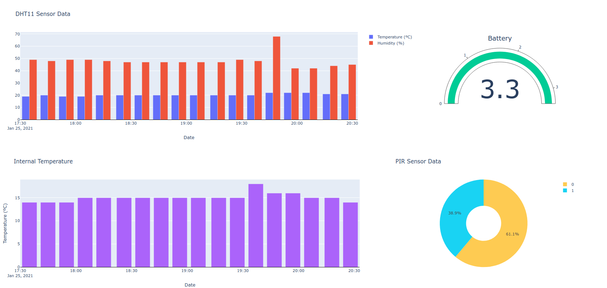

# plotly-dash

This is a simple app created with Plotly and Dash. It creates a dashboard which contains graphs made with different metrics. These metrics are obtained through API calls.

## Graphs
The dashboard contains the following graphs:
- Bar graph
- Pie chart
- Gauge chart



## Installation

Use the package manager [pip](https://pip.pypa.io/en/stable/) to install the app.

```bash
pip install -r requirements.txt
```


